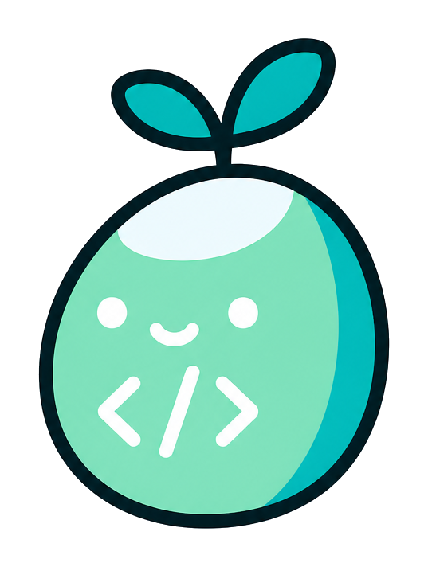
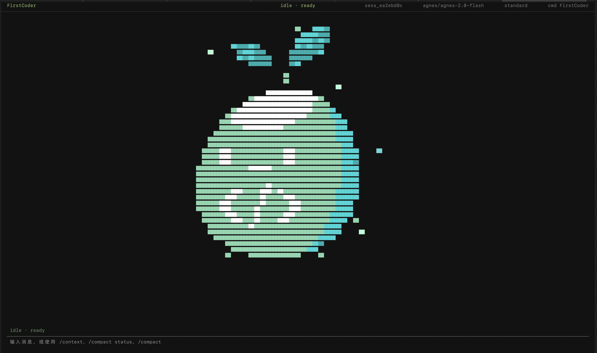
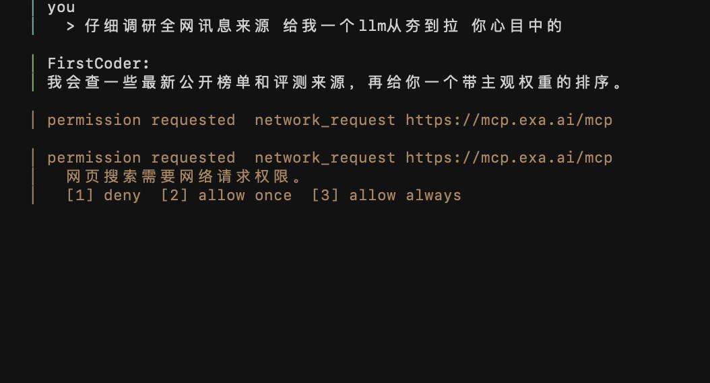

<p align="center">
  
</p>

<h1 align="center">FirstCoder</h1>

<p align="center">
  <strong>A local Python coding agent built to make agent internals visible.</strong>
</p>

<p align="center">
  <a href="#quickstart"></a>
  <a href="#tui"></a>
  <a href="#providers"></a>
  <a href="#development"></a>
  <a href="https://deepwiki.com/KomorGiaoGiao/FirstCoder"></a>
</p>

<p align="center">
  English
  · <a href="README.zh-CN.md">简体中文</a>
</p>

<p align="center">
  <a href="#why-firstcoder">Why</a>
  · <a href="#quickstart">Quickstart</a>
  · <a href="#tui">TUI</a>
  <!-- <span style="color:#888;">· FirstCoder vs Others</span> -->
  · <a href="#core-experiment">Innovation</a>
  · <a href="#skills">Skills</a>
  · <a href="#commands">Commands</a>
  · <a href="#architecture">Architecture</a>
  · <a href="#local-benchmark">Benchmark</a>
  · <a href="#development">Development</a>
  · <a href="#design-documentation">Docs</a>
  · <a href="#roadmap">Roadmap</a>
</p>

---

FirstCoder is a real, runnable local coding agent with a Textual TUI, tool calling, permissions, sessions, OpenAI-compatible providers, and a context compaction layer. The code is organized so you can read one subsystem at a time — whether you're using it daily or studying how it works.

| If you want to... | FirstCoder shows you... |
| --- | --- |
| Learn how coding agents actually work | Agent loop, tool calling, permissions, context compression |
| Build your own local agent | Drop-in provider, tools, session, and TUI modules |
| Understand agent architecture | Clean module boundaries you can explain in an interview |


## Why FirstCoder

Most coding-agent demos show the surface: a prompt goes in, code changes come out. FirstCoder focuses on the machinery in between — and makes every step inspectable.

| Question | Where to look |
| --- | --- |
| How model responses become tool calls | `firstcoder/agent`, `firstcoder/providers` |
| How tools touch files, shell, git, and the network | `firstcoder/tools` |
| How an agent pauses before risky actions | `firstcoder/permissions` |
| How reusable workflow instructions are discovered and loaded | `firstcoder/skills` |
| How long sessions are stored, compacted, and resumed | `firstcoder/context`, `firstcoder/session` |
| How a terminal UI streams state without hiding the loop | `firstcoder/app` |
| How to evaluate a tiny coding-agent workflow locally | `benchmark/local_pytest` |

## Quick Install

```sh
pipx install firstcoder
```

<details><summary>Other install methods</summary>

```sh
# Without pipx
python -m pip install firstcoder

# From source for development
python -m venv .venv
.venv/bin/python -m pip install -e ".[dev]"

# Windows PowerShell
py -m pip install firstcoder
```

</details>

## Quickstart

Start the TUI:

```sh
firstcoder
```

Run one message without opening the TUI:

```sh
firstcoder --message "Summarize this repository in one paragraph"
```

Use line-oriented interactive mode:

```sh
firstcoder --interactive
```

## Configuration

Create a starter config:

```sh
firstcoder config init
firstcoder config path
firstcoder config show
```

Default config locations:

```text
global:  ~/.config/firstcoder/config.toml
project: ./firstcoder.toml
```

Example:

```toml
model = "yurenapi/gpt-5.5"

[provider]
type = "openai-compatible"
name = "yurenapi"
base_url = "https://example.com/v1"
api_key_env = "FIRSTCODER_API_KEY"

[permissions]
mode = "ask"

[ui]
theme = "default"
```

Keep secrets in environment variables:

```sh
export FIRSTCODER_API_KEY="your-api-key"
```

Config precedence:

```text
CLI --provider
> environment variables / .env
> project firstcoder.toml
> global ~/.config/firstcoder/config.toml
> defaults
```

## TUI

FirstCoder's TUI is designed to expose the agent loop instead of hiding it. You can see the current session, provider/model, permission mode, activity state, streamed assistant output, tool calls, tool results, and permission prompts.

Empty session:



Tool calls appear in the conversation flow:


Permission requests pause the agent until the user decides:



The activity line is intentionally visible. When the model is thinking, streaming, running a tool, waiting for permission, or reading tool results, the UI should make that state obvious.

## Core Experiment

**Task-boundary-triggered compaction** is the most original part of FirstCoder.

Many agents summarize or truncate history when token pressure gets high. FirstCoder also handles token pressure, but its more interesting path is semantic: when the user moves to a new task, the agent can compact old task context before it pollutes the next one.

```text
user message
  -> model calls task_boundary(decision, basis_message_id)
  -> program generates candidate task_hash
  -> stable window confirms the task switch
  -> TASK_HASH_CHANGED triggers compaction
  -> old task content is micro-compacted
  -> session events preserve the transition for resume
```

The model never invents the hash. It only submits a small structured signal:

```json
{
  "decision": "same | new | uncertain",
  "basis_message_id": "msg_xxx"
}
```

Then the program generates a stable hash from the session id, the basis message id, and the task-boundary strategy version. A stable window prevents one bad model guess from immediately switching tasks.

| Design choice | Why it matters |
| --- | --- |
| Program-owned task hash | The model cannot invent or drift task identities |
| Stable-window confirmation | One mistaken `new` signal does not immediately compact history |
| Append-only event log | Compaction changes effective context but preserves the full record |

## Skills

FirstCoder discovers and loads skills at startup. Two levels exist:

- **Global skills**: installed under `$HOME/.agents/skills/` — shared across projects
- **Project skills**: located under `.agents/skills/` in the current repo — take priority

Skill discovery emits audit events:

```json
{"type": "skill_loaded", "skill_path": "skills/example.md", "content_hash": "..."}
{"type": "skill_required_file_loaded", "file_path": "docs/policy.md", "content_hash": "..."}
```

Project skills take priority over global skills. Global skills can add machine-local capabilities, but they cannot override project instructions, permission policy, or sandbox boundaries.

## Providers

The current mainline is **OpenAI Chat Completions-compatible**. That path supports normal messages, function tools, and streaming. An experimental **Anthropic** path is also available.

Supported providers:

- **OpenAI-compatible** (mainline): works with any OpenAI API endpoint (OpenAI, Azure, local Ollama, vLLM, etc.)
- **Anthropic** (experimental): native support for Claude messages, streaming, and thinking/cache behavior

Common provider environment variables:

| Provider | API key | Model | Default model |
| --- | --- | --- | --- |
| `openai` | `OPENAI_API_KEY` | `OPENAI_MODEL` | `gpt-4.1-mini` |
| `deepseek` | `DEEPSEEK_API_KEY` | `DEEPSEEK_MODEL` | `deepseek-chat` |
| `qwen` | `DASHSCOPE_API_KEY` | `QWEN_MODEL` | `qwen-plus` |
| `moonshot` | `MOONSHOT_API_KEY` | `MOONSHOT_MODEL` | `moonshot-v1-8k` |
| `zhipu` | `ZHIPUAI_API_KEY` | `ZHIPU_MODEL` | `glm-4-flash` |
| `openrouter` | `OPENROUTER_API_KEY` | `OPENROUTER_MODEL` | `openai/gpt-4.1-mini` |
| `ollama` | `OLLAMA_API_KEY` | `OLLAMA_MODEL` | `qwen2.5-coder:7b` |
| `anthropic` | `ANTHROPIC_API_KEY` | `ANTHROPIC_MODEL` | `claude-sonnet-4-5` |

DeepSeek example:

```sh
export FIRSTCODER_PROVIDER="deepseek"
export DEEPSEEK_API_KEY="your-api-key"
export DEEPSEEK_MODEL="deepseek-chat"
```

Any OpenAI-compatible service:

```sh
export FIRSTCODER_PROVIDER="openai-compatible"
export FIRSTCODER_API_KEY="your-api-key"
export FIRSTCODER_BASE_URL="https://example.com/v1"
export FIRSTCODER_MODEL="your-model"
```

Local Ollama:

```sh
export FIRSTCODER_PROVIDER="ollama"
export OLLAMA_BASE_URL="http://localhost:11434/v1"
export OLLAMA_MODEL="qwen2.5-coder:7b"
```

## Commands

Slash commands are the primary way to interact with FirstCoder outside of natural language:

| Command | Description |
| --- | --- |
| `/new` | Start a fresh session |
| `/resume` | Resume a previous session |
| `/compact` | Manually trigger context compaction |
| `/permission` | View or manage permission grants |
| `/help` | Show available commands |

CLI commands:

| Command | Description |
| --- | --- |
| `firstcoder` | Launch TUI in interactive terminal |
| `firstcoder --tui` | Explicitly launch Textual TUI |
| `firstcoder --message "..."` | Run one user message |
| `firstcoder --interactive` | Launch line-oriented REPL |
| `firstcoder --project <path>` | Specify project root directory |
| `firstcoder --data-root <path>` | Specify session / permission data directory |
| `firstcoder --session-id <id>` | Create or reuse a specific session |
| `firstcoder --provider <name>` | Override provider |
| `firstcoder --auto-approve` | Auto-answer permission requests with `allow_once` in REPL mode |
| `firstcoder --max-tool-rounds <n>` | Override maximum tool rounds per turn |
| `firstcoder config init` | Create initial global config |
| `firstcoder config path` | View config path |
| `firstcoder config show` | View effective provider config, without secrets |

TUI slash commands:

| Command | Description |
| --- | --- |
| `/sessions` | List session summaries |
| `/session <session_id>` | View a session |
| `/resume <session_id>` | Resume a session |
| `/share [session_id] [--tool-results]` | Export Markdown transcript |
| `/rename <title>` | Rename current session |
| `/context` | View context status |
| `/compact status` | View compaction status |
| `/compact` | Manually trigger context compaction |
| `/mode` | View current permission mode |
| `/mode conservative` | Use more cautious permission policy |
| `/mode standard` | Use default balanced policy |
| `/mode aggressive` | More permissive for common project dev operations |
| `/mode bypass` | Skip policy checks, for controlled local experiments |

Planned UX includes `/help`, `/new`, picker-style `/resume`, and long-term grant listing and revocation.

## Architecture

```text
user input
   |
   v
Textual TUI / CLI
   |
   +--> slash commands
   |       sessions / context / compact / permission mode
   |
   +--> AgentChatRunner
           |
           +--> AgentLoop
                   |
                   +--> ChatProvider
                   |       OpenAI-compatible / Anthropic experimental
                   |
                   +--> ToolRegistry
                   |       file / shell / git / web / todo / ask_user
                   |
                   +--> PermissionManager
                   |       allow / ask / deny / grants
                   |
                   +--> SkillRouter / SkillLoader
                   |       discover / route / load / audit
                   |
                   +--> ContextWindowManager
                           checkpoint / archive / compact / recovery
```

Project layout:

```text
firstcoder/
  agent/        agent loop, runtime session, user input recovery, loop limits
  app/          Textual TUI, command routing, runtime assembly
  config/       config files, .env, environment variable loading
  context/      event log, context projection, checkpoint, archive, compaction
  eval/         benchmark adapter, patch extraction, prediction generation
  permissions/  policies, grants, project-level permission manager
  providers/    provider abstraction and vendor adapters
  skills/       skill discovery, routing, loading, and session audit events
  session/      catalog, resume, transcript, share, redaction
  tools/        built-in tools, schemas, results, permission metadata
  utils/        JSON, schema, sandbox, subprocess, git helpers
benchmark/      local pytest benchmark and experiments
docs/           design notes, implementation plans, screenshots
tests/          pytest suite
```

## Local Benchmark

FirstCoder ships with multiple benchmark suites:

| Suite | Purpose |
| --- | --- |
| `benchmark/local_pytest` | Lightweight local probe: read task → inspect files → edit code → run tests |
| `benchmark/evalplus` | EvalPlus coding challenge evaluation |
| `benchmark/atcoder` | AtCoder competitive programming problems |
| `benchmark/harness_fast` | Fast harness-based evaluation |
| `benchmark/terminal_bench` | Terminal-based task evaluation (includes SWE-Bench-Fast) |
| `benchmark/topic_selfplay` | Self-play topic generation for task-boundary detection |

Run a smoke benchmark:

```sh
.venv/bin/python benchmark/local_pytest/runner.py \
  --workdir runs/local-pytest-smoke \
  --summary-out runs/local-pytest-smoke-summary.json \
  --max-tasks 1
```

See [docs/LOCAL_PYTEST_BENCHMARK.md](docs/LOCAL_PYTEST_BENCHMARK.md) for details.

## Development

Install dev dependencies:

```sh
python -m venv .venv
.venv/bin/python -m pip install -e ".[dev]"
```

Run all tests:

```sh
.venv/bin/python -m pytest
```

Run focused tests:

```sh
.venv/bin/python -m pytest tests/test_app_tui.py -q
```

Build a package:

```sh
python -m pip install build
python -m build
```

Test a global install locally:

```sh
pipx install --force .
firstcoder
```

Tests should avoid real API keys and network calls. Provider, tool, context, permission, session, and benchmark behavior should use fakes, fixtures, or temporary directories whenever possible.

## Design Documentation

Detailed design documents for each subsystem:

- [Agent Loop Guardrails](docs/AGENT_LOOP_GUARDRAILS.md) — verification, runtime, and tool-round guardrails
- [CLI / TUI Design](docs/CLI_TUI_DESIGN.md) — terminal UI architecture and command routing
- [Skill System](docs/SKILL_SYSTEM_DESIGN.md) — skill discovery, routing, and loading
- [Permissions System](docs/PERMISSIONS_DESIGN.md) — permission policies and long-term grants
- [Context Management](docs/CONTEXT_MANAGEMENT_DESIGN.md) — multi-level compaction and task boundaries
- [Providers](docs/PROVIDERS_DESIGN.md) — provider abstraction and vendor adapters
- [Tools System](docs/TOOLS_DESIGN.md) — built-in tools, schemas, and permission integration

## Philosophy

FirstCoder was built to answer a question most coding agents don't address:

> What actually happens inside when an agent streams, calls tools, asks for
> permission, compacts context, and resumes a session?

It's a real runnable agent — not a wrapper, not a chat box. The code is organized
so you can read one subsystem at a time and explain it in an interview or your own
study notes.

That said, it works great as a daily driver too.

## Roadmap

Near-term:

- Better `/help`, `/new`, and picker-style `/resume`.
- Grant listing and revocation commands.
- More polished streaming Markdown in the TUI.
- Stronger agent-loop guardrails around verification, runtime, and tool rounds.
- More benchmark coverage for local coding tasks.

Longer-term:

- Refine task-aware context compaction into a more reliable long-session memory layer.
- Deepen Anthropic protocol support, including native streaming, thinking/cache behavior, and provider-specific message semantics.
- Add long-term memory for stable project knowledge, user preferences, and reusable task context.
- Explore multi-agent orchestration for planner/executor/reviewer workflows and parallel coding tasks.
